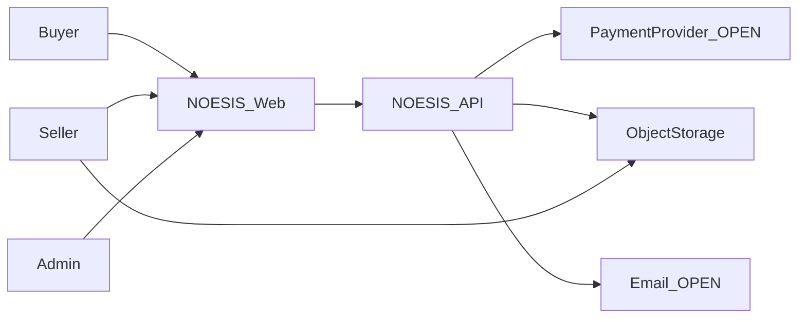
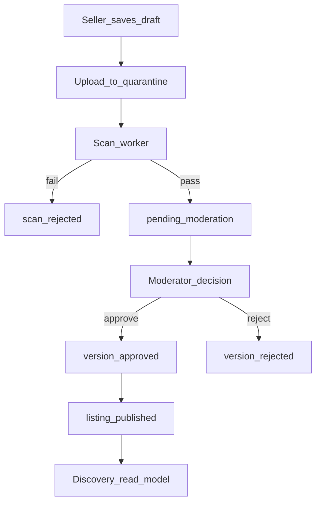
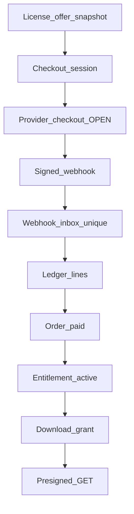

# NOESIS architecture

**Status:** Proposed design for review. No runtime exists.

Read [BRIEF](BRIEF.md) for product scope and [PROGRESS](PROGRESS.md) for gates. Module rules in [03-MODULES](architecture/03-MODULES.md) are authoritative for boundaries. State names in [06-STATE-MACHINES](architecture/06-STATE-MACHINES.md) are authoritative for lifecycles.

## System in one paragraph

A buyer uses a Next.js site to search one catalog through three lenses, then pays for a license offer. A NestJS modular monolith records the commercial facts in PostgreSQL. Money is an append-only ledger. Files enter a private quarantine bucket, get scanned off the API, and become downloadable only after moderation and only through a fresh entitlement check. Sellers are paid from ledger balances through a payment provider that has not been chosen. Admins moderate and audit. Workers drain a transactional outbox.

## Context

People never receive a long-lived URL to a paid archive. The payment provider is outside the trust boundary: signatures are verified, and the ledger is internal. Full context: [01-CONTEXT](architecture/01-CONTEXT.md). Containers: [02-CONTAINERS](architecture/02-CONTAINERS.md).

## Architectural rules

1. **One catalog.** Discovery lenses are views. They do not own products.
2. **Version bytes are immutable** after the upload completes. A change is a new version.
3. **Money is integer minor units** plus an ISO 4217 currency. Ledger lines are insert-only. Reversals are new lines.
4. **Every paid download rechecks** an active entitlement on the server that issues the link. Signed links expire.
5. **Moderation gates public visibility.** A rejected or quarantined version is not downloadable. A taken-down listing blocks new download grants. Existing entitlements are not mass-revoked unless the owner chooses that (**OPEN**, Q15).
6. **Archives stay quarantined** until checks pass. Seller code is not executed on the API or on any privileged host.
7. **Authorization is default-deny** and resource-scoped. Admin mutations write an audit row in the same transaction.
8. **Critical writes are idempotent** and durable. Process memory is not a source of truth.
9. **No cross-module repository imports and no cross-schema foreign keys.** Integrate by port or by event. The payment-capture composition root may call the payments, orders, and checkout ports in one database transaction ([data ownership](architecture/05-DATA-OWNERSHIP.md)).
10. **Policy knobs stay named and unset** until the owner approves them. Examples in documents use the word ILLUSTRATIVE.

## Module map

| Module | Owns | Talks to others by |
| --- | --- | --- |
| `iam` | Users, sessions, role assignments | Calls from every guard |
| `seller` | Seller profile, verification case, payout-account reference | Events |
| `catalog` | Product listing, taxonomy, kind, stacks | Events |
| `artifacts` | Versions, object pointers, scan reports | Events; storage port |
| `discovery` | Search documents and view definitions | Reads catalog/artifacts events into its own tables |
| `pricing` | License offers | Sync port: quote used by checkout |
| `checkout` | Checkout session and its idempotency keys. A persistent cart is **FUTURE** | Sync ports to pricing, catalog, payments |
| `orders` | Orders after capture | Consumes payment events |
| `payments` | Provider refs, webhook inbox, ledger, payouts | Provider port; emits events |
| `entitlements` | Rights to a version and download grants | Consumes order events |
| `reviews` | Reviews | Reads entitlement via port |
| `moderation` | Decisions, takedown, appeals | Events applied by catalog and artifacts |
| `notifications` | Delivery of messages | Consumes events |
| `admin` | Operator console authorization, break-glass | Audit in `admin` schema |
| `analytics` | Funnel read models | Consumes events; never source of money or access |

`admin` does not own listings. It invokes moderation and reads projections.

## Traceability

| Capability | Modules | Workflow | Contract | Data owner | Control | Tests | Slice |
| --- | --- | --- | --- | --- | --- | --- | --- |
| Register and sign in | `iam` | Account | `POST /v1/auth/*` | `iam` | Session cookie via BFF, password hash, lockout | Session fixation, default deny | 2 |
| Seller profile | `seller` | Onboarding | `PUT /v1/seller/profile` | `seller` | Only self; KYC vendor later | Cannot edit another seller | 2 |
| Create listing | `catalog` | Draft | `POST /v1/seller/products` | `catalog` | Owner scope | IDOR | 3 |
| Three lenses | `discovery` | Browse | `GET /v1/discovery/listings` | `discovery` read model | Only public documents indexed | Same product id in two views; no duplicate row | 3 |
| Upload archive | `artifacts` | Ingest | upload intent + complete | `artifacts` | Quarantine presign, size cap | Zip path traversal fixture, no exec | 4 |
| Scan | `artifacts` | Ingest | internal job | scan report | Isolated process | Failed scan never reaches private bucket | 4 |
| Moderate | `moderation`, `catalog`, `artifacts` | Review | admin decisions | `moderation` | Audited admin role | Rejected version not public | 5 |
| Price and license | `pricing` | Offer | offers on product | `pricing` | Immutable offer once purchased | Snapshot unchanged after price edit | 6 |
| Checkout | `checkout`, `payments` | Buy | `POST /v1/checkout/sessions` | both | Idempotency-Key | Replay same key; conflict on different body | 7 |
| Capture and books | `payments`, `orders` | Webhook | `POST /v1/payments/webhooks/:provider` | `payments` ledger, `orders` order | Signature, inbox uniqueness | Duplicate webhook one ledger posting | 7 |
| Download | `entitlements` | Deliver | `POST /v1/entitlements/:id/download-grants` | `entitlements` | Server-side check, short TTL | Revoked user denied; URL expiry | 8 |
| Review | `reviews` | Feedback | `POST /v1/reviews` | `reviews` | Entitlement required | Cannot review unpurchased product | 9 |
| Payout | `payments`, `seller` | Settle | internal + admin | `payments` | Hold until verification and reserve | Reconciliation delta alert | 10 |
| Takedown and appeal | `moderation` | Trust | admin routes | `moderation` | Audit | Public read disappears; ledger remains | 5, 11 |
| Notify | `notifications` | All | internal | `notifications` | Template data minimization | No secret in email body | 11 |

## Data flow (publish)

## Data flow (buy)

## Security posture (summary)

Threat detail: [10-SECURITY-THREAT-MODEL](architecture/10-SECURITY-THREAT-MODEL.md).

- OWASP-aligned controls are requirements on slices, not a claim that the product is secure.
- Verification badges, if ever shown, name the checks that ran (malware scan passed, human approved). They do not mean the code is safe to run.
- Rate limits on auth, search, upload-intent, checkout, and download-grant.
- Dependency and secret scanning in CI when code exists (slice 1). Not run in this phase because there is no application code.

## Consistency anchors

If two documents disagree, use this order:

1. Owner-approved decision (none yet, except CONFIRMED items in the brief).
2. State names in `06-STATE-MACHINES.md`.
3. Event names in `09-EVENT-CATALOG.md`.
4. Money movement in `11-PAYMENTS-LEDGER-PAYOUTS.md`.
5. ADRs for technology choice, and only at their stated status.

## Implementation

Vertical slices and rollback: [16-MVP-SLICES](architecture/16-MVP-SLICES.md). Tasks and definition of done: [18-ROADMAP](architecture/18-ROADMAP.md). Audit: [17-AUDIT](architecture/17-AUDIT.md). No slice is authorized to start until the owner accepts Gate A in [PROGRESS](PROGRESS.md).
