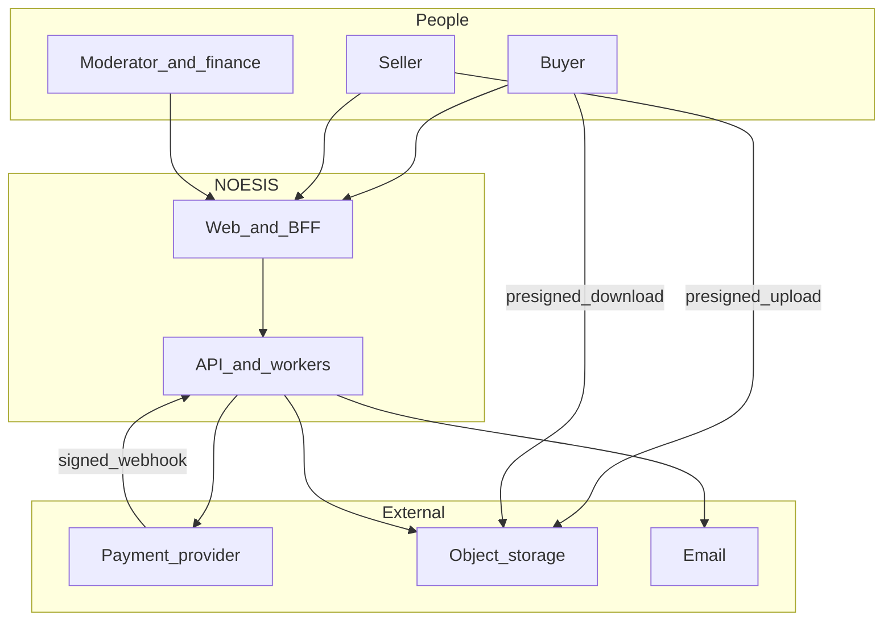

# System context

**Status:** PROPOSED diagram of the CONFIRMED product shape.

## Purpose

NOESIS lets a seller publish a versioned digital product and a buyer pay for a license and download the artifact. The platform moderates listings, keeps the financial books, and prevents unentitled downloads.

## People and external systems

| Actor | Trust | Interaction |
| --- | --- | --- |
| Buyer | Authenticated after sign-in; anonymous for public reads | Browse, buy, download, review |
| Seller | Authenticated; resource-scoped | Draft, upload, unpublish, read own balance |
| Moderator / finance admin | Privileged; every mutation audited | Review, takedown, hold payout, reconcile |
| Payment provider | Untrusted payload until signature check | Checkout, refunds, payouts, webhooks. Vendor **OPEN** |
| Object storage | Trusted infrastructure boundary | Quarantine, private, public preview buckets |
| Email provider | Trusted transport | Notifications. Vendor **OPEN** |
| Scanner engine | Trusted only inside the scan process | Malware and archive verdict. Engine **OPEN** |
| Identity proofing | Not integrated | **OPEN** with seller verification policy |

## Context diagram

## Trust boundaries

1. Browser to web: public network. Cookies are HttpOnly. XSS on the web app is in scope for the threat model.
2. Web to API: server-side. The browser does not hold the API credential.
3. API to payment provider: outbound TLS plus inbound webhook signature.
4. Seller browser to object storage: presigned PUT limited to one quarantine key, size, and expiry.
5. Scan process to object storage: separate credentials from the API’s payment role.
6. Admin UI to private bytes: not allowed by default.

## In-scope behavior

- Public read of approved listings.
- Authenticated seller and admin workflows in the brief.
- Sandbox payment flows and internal ledger.
- Quarantine and scan pipeline.
- Entitlement and expiring download links.

## Out of scope

- Running seller applications.
- Real acquiring, real KYC, production DNS, and production secrets.
- Marketplace services (custom work).
- Native mobile apps.
- A second catalog.

## Geographic note

“Global” describes the product intent (**CONFIRMED** as an aim). The first legal and payment footprint is **OPEN** (question Q1). The design does not assume multi-region active-active.
