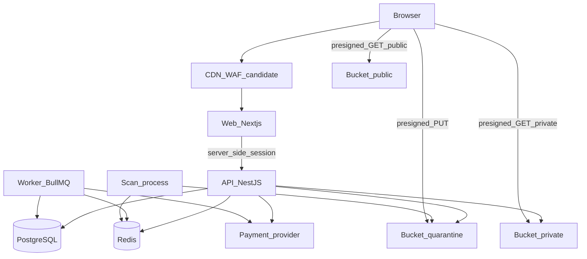

# Containers

**Status:** PROPOSED topology. Vendors for host, database, Redis, and object storage are not purchased.

## Container diagram

## Containers

| Container | Data it stores | Scales on | Failure |
| --- | --- | --- | --- |
| CDN/WAF | Cached public HTML and public images only | Traffic | Origin still serves; private buckets are not cached |
| Web | No business truth. Optional short cache of public pages | Requests | API remains source of truth |
| API | Request handling only; durable state in Postgres | CPU | Retryable clients; idempotent writes |
| Worker | Job attempts in Redis; results in Postgres | Queue depth | Redelivery; consumers idempotent |
| Scan | Temp files on local disk, wiped after verdict | Upload volume | Version stays `quarantined` or `scanning`; never auto-approves |
| PostgreSQL | All module schemas | Disk and connections | PITR. RPO target is proposed in the NFR doc |
| Redis | Queue state, rate-limit counters, optional session cache | Memory | Rebuild queues from outbox; do not rebuild money from Redis |
| Buckets | Object bytes | Storage | Version row points at a key; loss of an object is an incident, entitlement remains |

## Why the web is a BFF

**PROPOSED.** Next.js Route Handlers or server actions call NestJS. The session cookie is set for the web host (`__Host-` prefix, HttpOnly, Secure, SameSite=Lax).

NestJS session record lives in PostgreSQL (`iam.sessions`) so revocation survives Redis loss. Redis may cache the session.

If web and API later share a parent domain and you drop the BFF, the guard model stays. The cookie transport changes. That is an implementation detail of `iam`, not a domain change.

## Synchronous vs asynchronous

| Flow | Style | Why |
| --- | --- | --- |
| Public listing read | Sync HTTP | SEO and buyer latency |
| Price quote during checkout | Sync in-process port | Must snapshot inside the commercial decision |
| Provider create-checkout | Sync HTTP after local row exists | Buyer is waiting; local session exists first so retries have an id |
| Webhook apply | Async job after inbox insert | Provider timeout must not roll back a stored event |
| Scan | Async | Slow, untrusted, isolated |
| Email | Async | Not part of the transaction |
| Discovery index | Async from events | Search is a read model |
| Ledger post | Sync inside the webhook job’s DB transaction | Money and inbox row commit together |

## Transaction boundaries

| Use case | Single database transaction includes | Explicitly outside |
| --- | --- | --- |
| Register | User, credential, outbox `iam.user_registered` | Welcome email |
| Publish listing | Listing state, outbox `catalog.listing_published` | Search index |
| Start checkout | Session row, price snapshot, idempotency row | Provider HTTP |
| Apply capture webhook | Inbox row, ledger legs, order row, outbox `payments.charge_captured` and `orders.order_paid` | Entitlement insert (next consumer), email |
| Issue entitlement | Entitlement row, outbox | Download URL |
| Issue download | Grant row, audit | Presign call after commit |
| Moderate | Decision row, audit, outbox | Bucket copy (worker after commit) |
| Record payout settled | Ledger legs, payout row, inbox | — |

Webhook signature verification happens **before** the transaction. A bad signature does not open a write transaction except a security counter/log.

Presign happens **after** the grant commits. If presign fails, the grant expires unused. The buyer retries; the entitlement check runs again.

## Process memory

Allowed: request-scoped DTOs, in-flight provider responses about to be persisted.
Forbidden: cart, session authority, order status, entitlement, ledger balances, scan verdicts.

## Internal HTTP

Workers do not call back into public controllers for domain changes. They use module application services. This avoids auth gaps and double idempotency paths.

## Open items that affect containers

- ADR 0006 hosting choice (managed containers vs VM).
- Whether CDN is Cloudflare, Vercel’s edge, or another WAF.
- Scanner engine packaging (sidecar binary vs HTTP to an isolated scanner). The container boundary stays either way.
