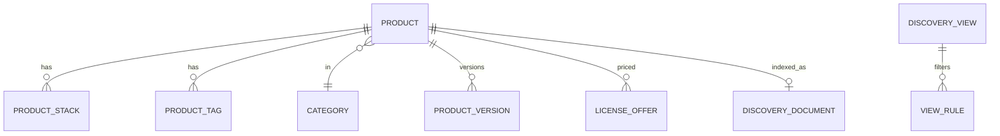
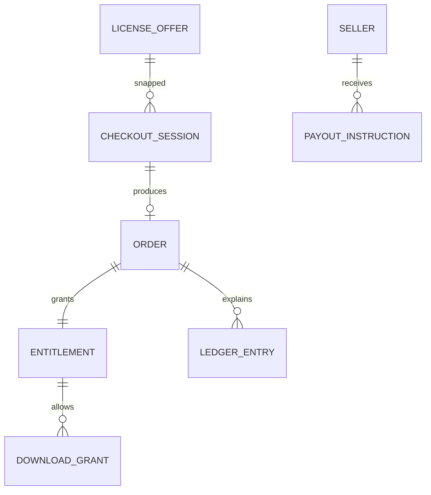

# Domain model

**Status:** PROPOSED. Policy enums exist so rules can be filled in later. They are not approved values.

## Catalog identity

There is no `JavascriptProduct` table and no `BusinessAppCatalog`.

| Type | Fields that matter |
| --- | --- |
| `Product` | `id`, `seller_id`, `slug`, `kind` (`code_asset` or `business_application`), `category_id`, `listing_state`, `curated` boolean, `title`, `summary` |
| `ProductStack` | `product_id`, `stack_code` (`javascript`, `typescript`, others as data) |
| `DiscoveryView` | `view_id`, human label, enabled |
| `DiscoveryDocument` | `product_id` primary key, denormalized public fields, `listing_state`, search vector |

`curated` supports an editorial JS/TS lens if the owner chooses that meaning (Q in assumptions). If the lens is only a stack filter, the flag can stay unused.

## Commercial identity

| Type | Fields that matter |
| --- | --- |
| `LicenseOffer` | `id`, `product_id`, `version_id` pinned for sale, `amount_minor`, `currency`, `license_code`, `update_policy`, `state` (`active` or `archived`) |
| `CheckoutSession` | snapshot of amount, currency, `commission_bps`, seller, offer, version, `state`, `idempotency_key` |
| `Order` | `id`, `checkout_id`, `buyer_user_id`, amounts copied again, `state` |
| `Entitlement` | `order_id`, `product_id`, `product_version_id`, `update_policy`, `subject_type` (`user` or `pending_claim`), `subject_id`, `state` |
| `DownloadGrant` | `entitlement_id`, `expires_at`, `object_key` internal, not shown as a permanent link |
| `LedgerEntry` | `id`, `currency`, `account`, `direction` (`debit` or `credit`), `amount_minor`, `source_type`, `source_id`, `leg`, `posted_at` |
| `PayoutInstruction` | `seller_id`, `currency`, `amount_minor`, `period`, `state`, `idempotency_key` |

`commission_bps` is a snapshot integer (basis points). Null until a policy exists means checkout capture of a real fee is blocked. Tests may set a fixture value.

## Artifact identity

| Type | Fields that matter |
| --- | --- |
| `ProductVersion` | `id`, `product_id`, `version_label`, `state`, `byte_size`, `sha256`, `quarantine_key`, `private_key` nullable until promoted |
| `ScanReport` | `version_id`, `verdict` (`pass` or `fail`), `reason_code`, `engine`, `scanned_at` |
| `ModerationDecision` | `id`, `subject_type`, `subject_id`, `action`, `actor_id`, `reason`, `created_at` |

`private_key` stays null while the object is only in quarantine.

## Identity

| Type | Fields that matter |
| --- | --- |
| `User` | `id`, `email`, `password_hash`, `state` |
| `Session` | `id`, `user_id`, `expires_at`, `revoked_at` |
| `RoleAssignment` | `user_id`, `role` |
| `SellerProfile` | `id`, `user_id`, `display_name`, `verification_state` |
| `PayoutAccountRef` | `seller_id`, `provider`, `provider_account_id`, `state` |

## Review and audit

| Type | Fields that matter |
| --- | --- |
| `Review` | `product_id`, `author_user_id`, `rating`, `body`, `state` |
| `AuditEvent` | `actor_id`, `action`, `subject`, `reason`, `correlation_id`, `at` |
| `OutboxMessage` | `id`, `type`, `payload`, `occurred_at`, `published_at` |
| `InboxMessage` | `event_id` unique, `processed_at` |

## Invariants (model level)

1. `DiscoveryDocument.product_id` is unique. Two lenses means two queries, not two documents with different ids.
2. `ProductVersion` checksum cannot be updated after it is set. Enforcement: no update method; corrections are new rows. Database trigger or column privilege is a slice 4 task.
3. `LedgerEntry` has no update or delete path in the application. Database role used by the API should not have `UPDATE` or `DELETE` on that table (**PROPOSED** hardening, slice 7).
4. Sum of debits equals sum of credits per `source_id` (the journal). A constraint trigger or a mandatory reconciliation query enforces this.
5. `Order.checkout_id` is unique. One successful session, one order.
6. `Entitlement.order_id` is unique for MVP (one product per order under A2/A7).
7. Money fields are `bigint` minor units. Currency is `char(3)`.

## Version label

**PROPOSED:** seller-supplied semantic version string, unique per product. The platform does not infer update rights from the string alone. `update_policy` on the offer does that, once approved.

## What is deliberately not an entity

- Per-lens product.
- Shopping cart as its own module’s aggregate. If a cart appears, it is a `checkout` collection of offers that must share a seller before a session starts.
- Wallet balance as a mutable column that is the only balance. A projection may cache the sum of ledger lines and must be rebuildable.
