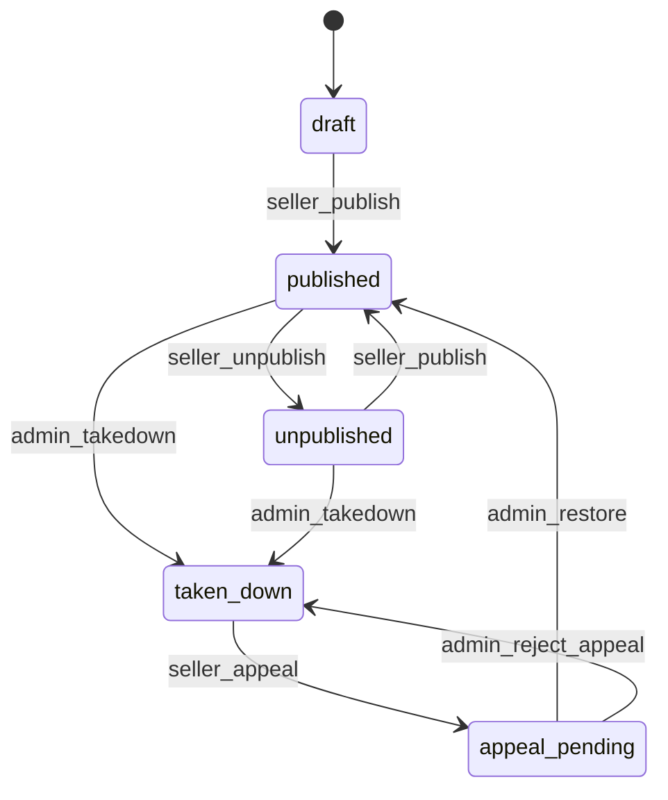
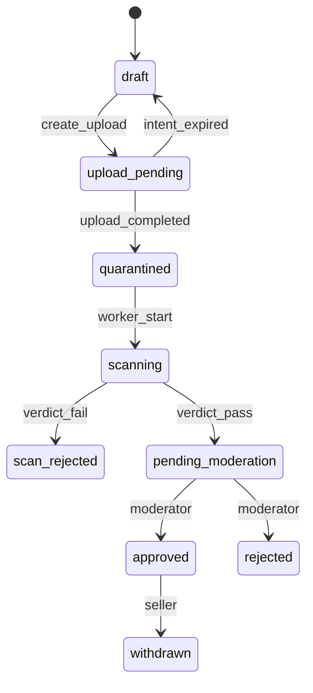
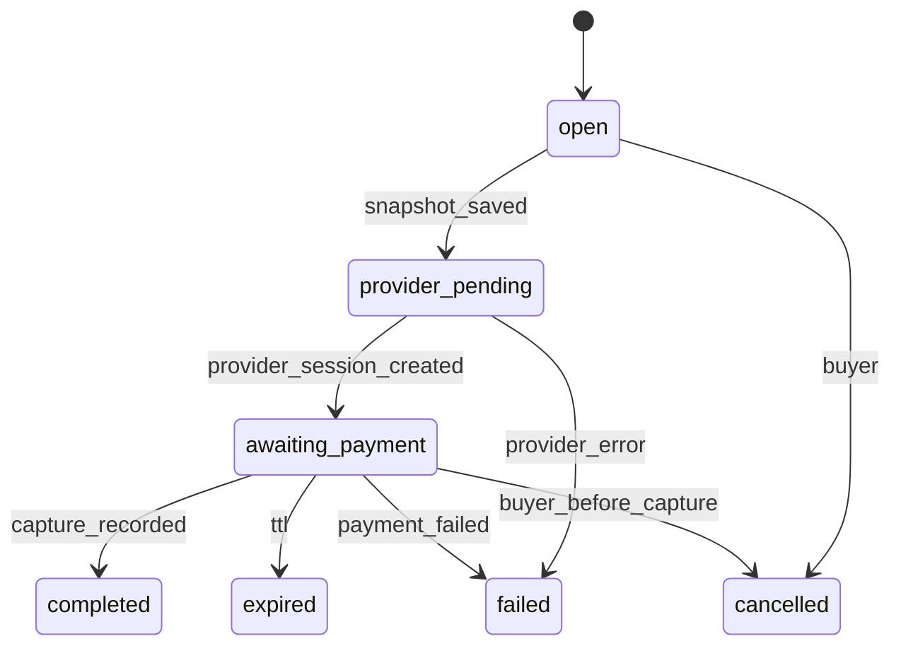

# State machines

**Status:** PROPOSED names. Guards that encode refund days, reserve days, or KYC vendors are OPEN and marked.

Authoritative names for the rest of the pack live here.

## Listing

| From | To | Actor | Guard |
| --- | --- | --- | --- |
| draft | published | seller | **ACCEPTED.** At least one version `approved` with `private_key` set. Seller email is verified (Q19). Seller is `verification_approved` and not `suspended` |
| published | unpublished | seller | Owner |
| unpublished | published | seller | Same as first publish |
| published or unpublished | taken_down | admin | Reason required, audit |
| taken_down | appeal_pending | seller | One open appeal |
| appeal_pending | published | admin | Audit. Does not auto-approve a rejected version |
| appeal_pending | taken_down | admin | Audit |

Public discovery index contains the product only when `listing_state = published` and a sellable approved version exists. Slice 3 rebuild enforces both conditions. It does not add the seller publish route. The artifacts port reports no sellable version until a later slice.

Unpublish and takedown do not delete `orders` or ledger lines.

**OPEN:** whether takedown freezes existing entitlements. Proposed interim behavior is in Q15: stop new grants, do not mass-revoke.

## Product version

Replacing bytes is a new version row. There is no transition back to `upload_pending` and no `changes_requested` state. A rejection includes a note; the seller creates another version.

### Version transitions to implement

| From | To | Actor | Notes |
| --- | --- | --- | --- |
| draft | upload_pending | seller | Declared size within the configured maximum (Q14) |
| upload_pending | draft | system | Presign expired and no object was stored |
| upload_pending | quarantined | system | Checksum set once |
| quarantined | scanning | scan | |
| scanning | scan_rejected | scan | Terminal for this upload |
| scanning | pending_moderation | scan | |
| pending_moderation | approved | admin | Eligible to sell and to promote object |
| pending_moderation | rejected | admin | Terminal |
| approved | withdrawn | seller | Not sold going forward. Existing entitlements follow update policy |

Rejected and scan_rejected versions are never promoted to the private bucket.

## Seller verification

| From | To | Actor | Guard |
| --- | --- | --- | --- |
| draft | verification_submitted | seller | Required fields for the chosen Q3 option |
| verification_submitted | verification_approved | admin or provider webhook | Evidence recorded |
| verification_submitted | verification_rejected | admin or provider | Reason |
| verification_approved | suspended | admin | Blocks publish and payout submit |
| verification_rejected | verification_submitted | seller | New evidence |

**ACCEPTED.** Sellers may register and save drafts before verification. Publish requires `verification_approved`. Payout submit also requires `verification_approved`.

## Checkout session

| From | To | Guard |
| --- | --- | --- |
| open | provider_pending | Offer `active`, version `approved`, listing `published`, currency allowed, snapshot stored, idempotency recorded |
| provider_pending | awaiting_payment | Provider reference stored |
| awaiting_payment | completed | Webhook or reconcile proved capture, inbox inserted, ledger posted, order created |
| awaiting_payment | expired | No capture. Late capture after expiry is an incident: do not fulfill automatically; alert finance |
| * | failed | Safe to retry with a new session. Same idempotency key returns the original result |

Completed is terminal for the session.

## Order

| From | To | Actor | Guard |
| --- | --- | --- | --- |
| — | paid | system | Only with ledger journal for capture |
| paid | refund_pending | admin or policy job | Policy guard **OPEN**. Ledger reversal prepared |
| refund_pending | refunded | system | Provider refund confirmed, ledger posted, entitlement revoke requested |
| refund_pending | partially_refunded | system | Same, amounts match lines |
| paid | disputed | webhook | Entitlement `frozen` **PROPOSED** until outcome |
| disputed | dispute_won | webhook | Entitlement `active` if it was frozen |
| disputed | dispute_lost | webhook | Treat as refund plus fee posting. Fee payer **OPEN** |

No `pending` order. Unpaid attempts stay on the checkout session.

## Entitlement

| From | To | Guard |
| --- | --- | --- |
| — | active | `orders.order_paid` consumer, order not already entitled |
| active | frozen | Dispute opened or admin suspension |
| frozen | active | Dispute won or admin lift |
| active or frozen | revoked | Refund completed, dispute lost, or explicit admin revoke |
| revoked | active | Only a reversing financial event (dispute reversal). Never a moderator “nice to have” without a ledger reason |

Download guard: state is `active`, listing takedown rule allows it (Q15), version policy allows the requested version, grant not expired.

## Payout instruction

| From | To | Guard |
| --- | --- | --- |
| — | scheduled | Available ledger balance after reserve window. Window **OPEN** |
| scheduled | held | Seller not approved, or finance hold |
| held | scheduled | Hold cleared |
| scheduled | submitted | Provider accepted, idempotency key |
| submitted | settled | Provider webhook, ledger payout journal posted |
| submitted | failed | Safe retry with the **same** idempotency key |
| scheduled or held | cancelled | Admin, audit |

## Webhook inbox

`received → processed` or `received → failed`. Duplicate provider event id does not create a second row. `failed` retries until processed or dead-letter.

## Notification

Not a business state machine. Message `queued → sent | failed`. Failure does not roll back the domain event.
