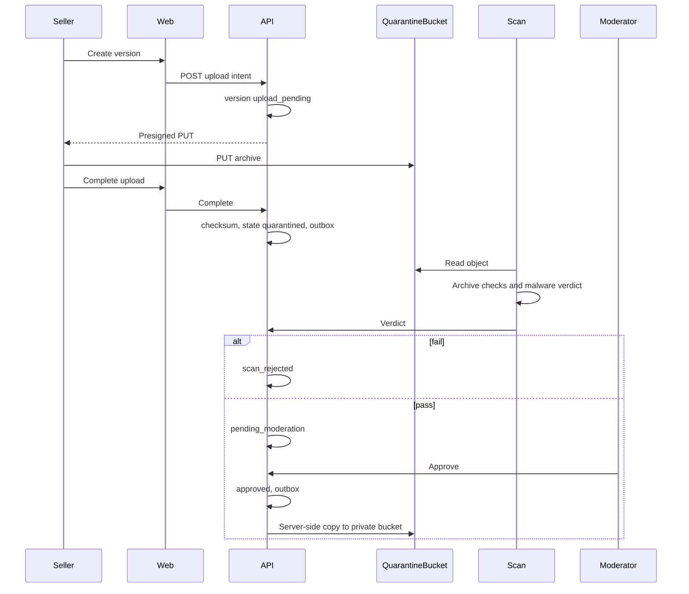
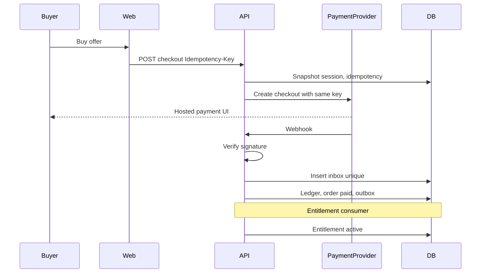
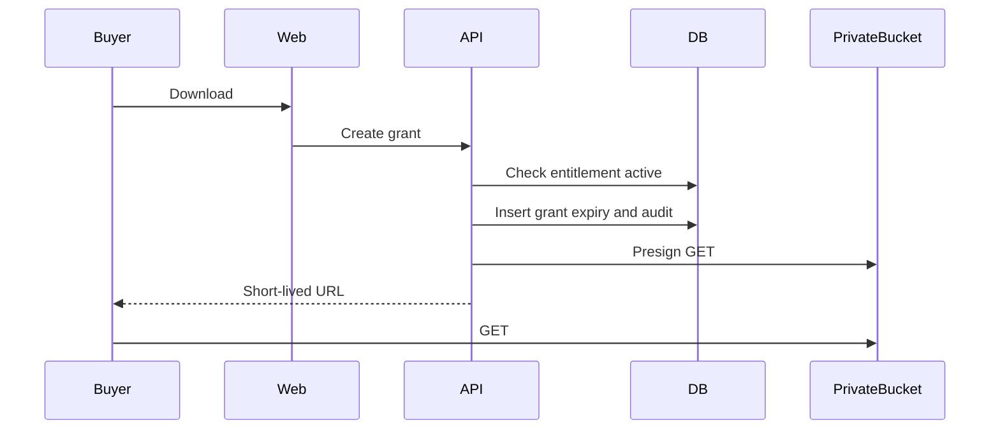
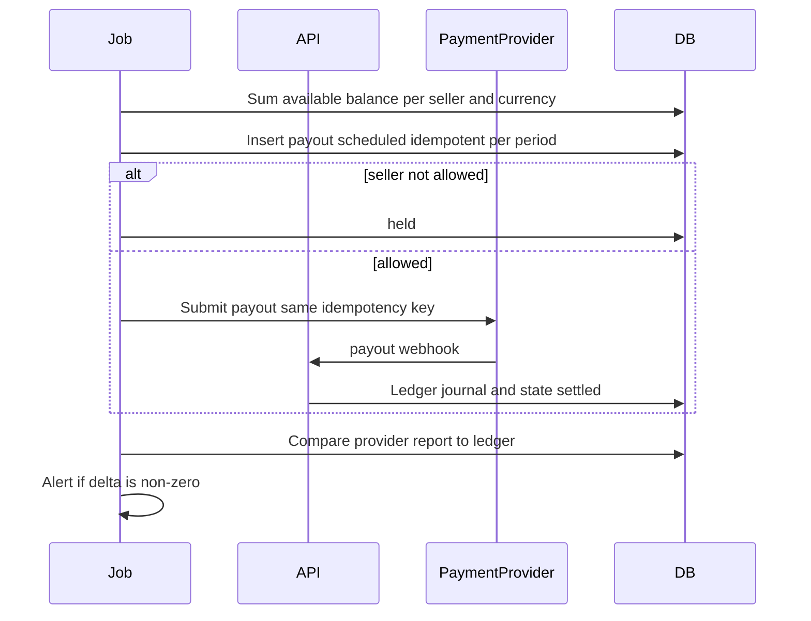
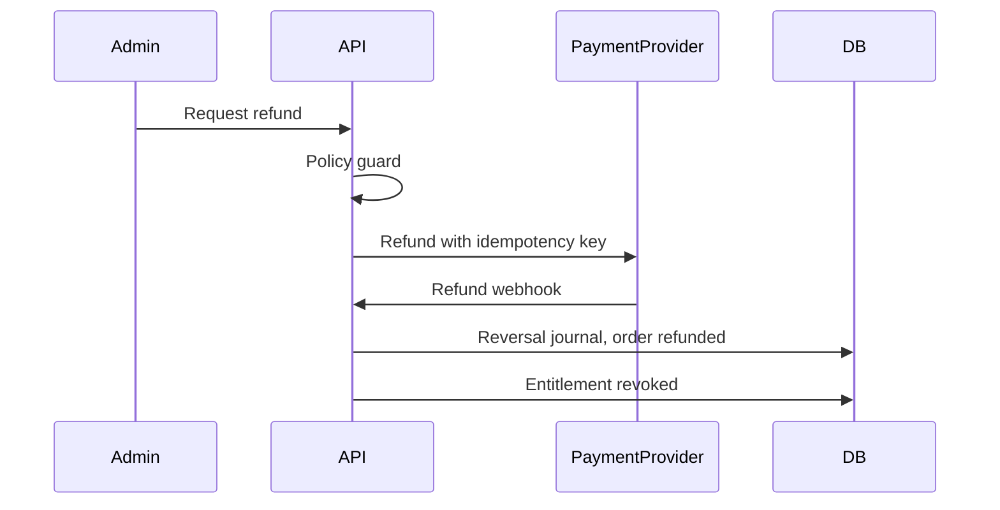

# Sequences

**Status:** PROPOSED. State names match [06-STATE-MACHINES](06-STATE-MACHINES.md). Provider is unnamed.

## Upload and review

The copy to the private bucket runs in a worker after the approval transaction commits. If the copy fails, the version stays `approved` with `private_key` null and a retryable job. It is not publicly listed as downloadable until `private_key` is set. Checkout guard requires that.

Seller code is not started. The scan process lists archive entries and scans bytes.

## Checkout and entitlement

If the webhook is delivered twice, the second insert hits the unique provider event id and returns success without new ledger lines.

If the process dies after the inbox insert and before commit, the database rolls back and the provider redelivers.

If the process dies after commit and before the entitlement consumer finishes, the outbox relay retries. Entitlement unique on `order_id` makes the retry safe.

## Download

Presign is after commit. The URL is not written into the order. A revoked entitlement fails the next grant attempt even if an old URL has not expired yet. TTL is therefore short (**PROPOSED** name `DOWNLOAD_URL_TTL_SECONDS`, value not approved; design point 60 seconds in the NFR doc as a proposal).

## Payout

## Refund (policy guard open)

Until the owner sets the guard, the admin endpoint can exist in staging behind a feature flag defaulting off. It must not be a silent always-on refund.

## Failure notes

| Situation | Outcome |
| --- | --- |
| Presign upload expires | Version returns to `draft` or stays a new attempt; no partial public file |
| Scan worker crash | Job retries; state remains `scanning` with a lease so two workers do not both pass |
| Approval without private copy | Not sellable |
| Webhook bad signature | 401, no inbox row |
| Capture after session expired | No auto-fulfill; finance alert; manual resolution |
| Download presign fails | Grant unused until expiry; buyer retries |
| Payout submit uncertain | Reconcile with provider by idempotency key before a second submit |
