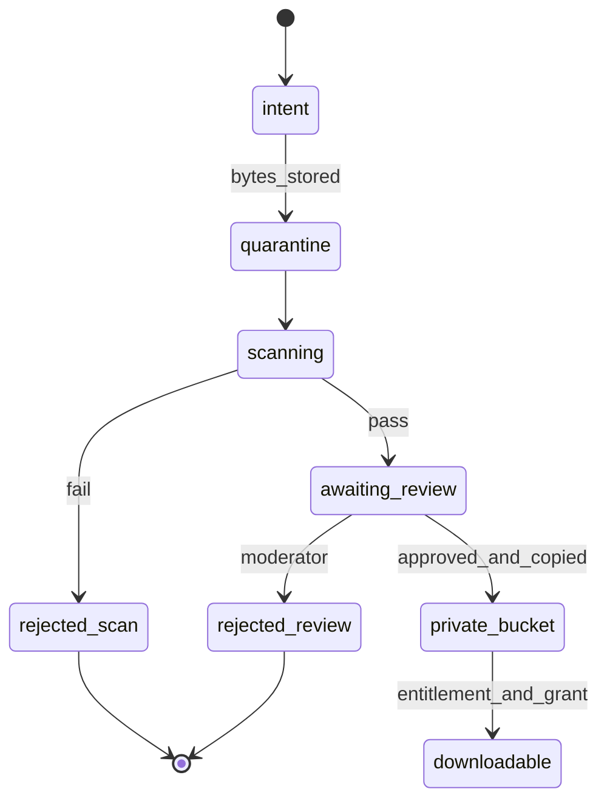

# Artifact lifecycle

**Status:** PROPOSED pipeline. Max size is not approved (Q14 design point: 2 GB compressed).

## Buckets

| Bucket | Contents | Access |
| --- | --- | --- |
| quarantine | Fresh uploads | Presigned PUT by seller; read by scan role; no public ACL |
| private | Approved archives | Presigned GET only after entitlement grant; no public ACL |
| public | Screenshots, non-paid preview files | Public read. Sellers must not place the paid archive here |

Block public ACLs at the account policy when the vendor exists.

## Lifecycle

State names in [06-STATE-MACHINES](06-STATE-MACHINES.md) remain authoritative (`scan_rejected`, `pending_moderation`, `approved`). This diagram is the file’s movement, not a second status enum.

## Upload intent

- Seller owns the version and it is in `draft` or `upload_pending`.
- Declared content type is on an allowlist (**PROPOSED:** `application/zip` and `application/gzip`). Other formats wait until we can scan them.
- Declared size ≤ configured maximum.
- Key is server-generated, unguessable, prefixed by `quarantine/{sellerId}/{versionId}/`.
- Presign expiry **PROPOSED** 15 minutes.
- Complete-upload sets sha256 and byte size. A second complete with a different checksum is `conflict`.

The API does not proxy the bytes.

## Scanner duties

Isolated process. Credentials: `GetObject` on quarantine prefix, and a queue credential. No database role on `payments`.

Checks, all must pass:

- Object size equals declared size, within the max.
- Uncompressed size cap and compression ratio cap (zip bomb).
- Entry count cap.
- No entry path is absolute, contains `..`, or is a symlink escape.
- Malware engine verdict pass. Engine **OPEN**; the port returns `pass` or `fail` plus `reason_code`.
- Timeout and memory cap. Failure is `scan_rejected`, not an approval.

The worker does not call install scripts, package managers, or interpreters on the archive.

## Promotion

On `approved`, a worker server-side copies quarantine object to `private/{productId}/{versionId}/{sha256}`. Then it sets `private_key`. Then the version may be sold.

Delete quarantine object after a successful copy and a retention window (**PROPOSED** 7 days in assumptions, not approved), so a bad copy can be retried.

## Download

See sequence doc. Additional rules:

- Object storage key is not in HTML, JSON public APIs, or email.
- CDN cache disabled for the private host.
- Checksum available to the entitled buyer so they can verify the file (**PROPOSED** to show sha256 on the order page).

## Update access

Entitlement records the purchased `product_version_id` and `update_policy`. When policy is `exact_version`, the grant signs that version’s key. When policy is `major_line` or `all_future`, the grant resolves the allowed version **at download time** through the artifacts port and signs that key. Policy value is **OPEN**. The resolver is a pure function with tests for all three codes so the choice is configuration.

## Takedown and revocation

- New checkout guard fails if listing is `taken_down` or version is not sellable.
- New download grants follow Q15. Proposed interim: no new grants after takedown until restore.
- Existing presigned URLs die by TTL.
- `revoked` entitlement fails grant creation immediately.
- Withdrawn version: not sold to new buyers; existing exact-version entitlements can still download unless counsel says otherwise (**OPEN**, same family as Q15).

## Moderation gate

`pending_moderation`, `scan_rejected`, and `rejected` are invisible to discovery and impossible to attach to a new offer activation. An offer cannot pin a version that is not `approved` with a `private_key`.

## Seller mistakes

Replacing a file is a new version. The old sha256 remains on the old version forever.

## Observability

Metrics: uploads completed, scan fail rate, time in quarantine, promotion failures, download grants denied. Alert if any object sits in `scanning` beyond the lease times two.
