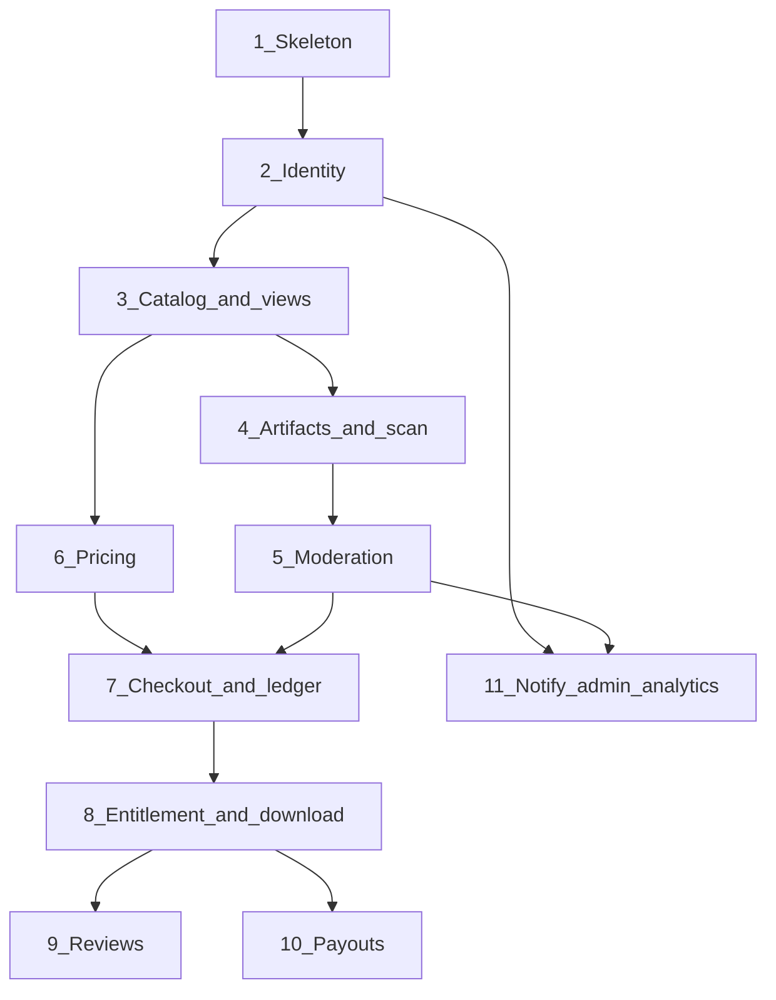

# MVP slices

**Status:** Proposed order. Not scheduled. Not permission to start. Gate A in [PROGRESS](../PROGRESS.md) comes first. Live money needs Gate B. Production hosting needs Gate C.

Tasks, security checks, and the definition of done for each slice are in [18-ROADMAP](18-ROADMAP.md). This file remains the dependency order. The audit that produced that roadmap is [17-AUDIT](17-AUDIT.md).

Staffing is unknown. Durations are omitted on purpose.

## Dependency order

Slice 7 needs both a sellable approved file (slice 5) and a price (slice 6).

## Slice 0 — this pack

Documentation. Acceptance is the checklist in [PROGRESS](../PROGRESS.md). Rollback: revert the documentation commit. No runtime.

## Slice 1 — Skeleton

**Build:** `apps/web`, `apps/api`, `apps/worker`, `apps/scan` empty shells, OpenAPI stub, health, structured logs, correlation id, CI with architecture-import test and secret scan, local Postgres and Redis via compose. No product features.

**Acceptance:** CI green on empty modules; log line contains correlation id; `.env.example` still has no secrets; scan process has a separate config flag and no payments connection string.

**Threats:** secrets in git, missing trace.
**Ops:** health check only.
**Rollback:** remove the apps; no data migration.

## Slice 2 — Identity and roles

**Build:** register, login, logout, session in Postgres, roles buyer/seller/admin, BFF cookie, default-deny guard helper, seller profile draft.

**Acceptance:** tests in [15-TEST-STRATEGY](15-TEST-STRATEGY.md). Password hash not in logs. Admin route denied for buyer.

**Threats:** takeover basics, CSRF posture, IDOR on profile.
**Ops:** lockout metric.
**Rollback:** feature is the whole auth surface; disable web login. No money involved.
**Flag:** none. Later slices depend on it.

## Slice 3 — Catalog and three views

**Build:** product draft, kind, stacks, tags, category, public SSR pages, discovery projection, views `general`, `javascript`, `business_apps`.

**Acceptance:** one inserted product with kind `business_application` and stack `typescript` is returned for both `javascript` (if stack rule applies) and `business_apps`, and there is still one `product_id`. Draft is 404 to anonymous. If curation flag is required, test both “flag off excluded” and “flag on included.”

**Threats:** spam create rate limit, IDOR on draft edit.
**Ops:** index rebuild command.
**Rollback:** hide routes; tables can remain. No buyer harm.

**Q6 is accepted.** The ten initial categories are seeded with stable ids. The JS/TS lens is the accepted stack filter. Do not add a second product table. Publication and moderation stay in later slices.

## Slice 4 — Upload and scan

**Build:** upload intent, quarantine presign, complete, scan worker, archive fixtures, verdict stored. No private promotion yet.

**Acceptance:** traversal and zip-bomb fixtures fail closed. Happy path ends in `pending_moderation`. API image does not contain the extractor entrypoint used by scan (separate image **PROPOSED**). Local results are in PROGRESS. Q14 stays OPEN.

**Threats:** malicious archive row in the threat model.
**Ops:** scan queue age alert.
**Rollback:** disable upload intent endpoint. Quarantine objects can be deleted by prefix.

## Slice 5 — Moderation

**Build:** queue, approve, reject, takedown, appeal states, audit rows, promotion to private bucket on approve.

**Acceptance:** rejected and unscanned versions absent from public API. Approve without copy does not mark sellable. Takedown removes discovery document. Audit row in the same test transaction. Local results are in PROGRESS. Q15 stays OPEN. A structural scan pass is not a malware clearance.

**Threats:** admin misuse, accidental public ACL (test bucket policy in staging).
**Ops:** queue depth.
**Rollback:** stop promotion worker; existing private keys remain. Do not delete private objects as a rollback.

## Slice 6 — Pricing display

**Build:** immutable offers, archive, public price, snapshot function used later by checkout. No charge.

**Acceptance:** editing a price creates a new offer id; old id unchanged. Legal text is a version id. `license_code` and `update_policy` stored and unset or fixture-only. Local results are in PROGRESS. Gate B stays OPEN. No payment provider is called.

**Threats:** SSRF via demo URL — render as external link only.
**Ops:** none financial.
**Rollback:** hide prices. Offers table retained.

## Slice 7 — Checkout, fake provider, ledger

**Build:** checkout session, idempotency, fake provider, webhook inbox, journals, order `paid`, reconciliation query, flags `checkout.enabled` default off in shared envs.

**Acceptance:** threat tests for signature and duplicate webhook. Journal balanced. Prisma (or fallback ORM) spike evidence attached: partial unique index and a multi-line transaction. If Prisma cannot do it, switch per ADR 0002 before continuing.

**Threats:** spoofing, double post, privileged SQL updates.
**Ops:** delta alert wired to log at minimum.
**Rollback:** `checkout.enabled=false`. Do not delete ledger rows. Forward-fix only.

**Blocked for real cards** until Gate B and ADR 0004. This slice does not remove that block.

## Slice 8 — Entitlement and download

**Build:** consumer on `orders.order_paid`, grant, presign, revoke function called by refund events, takedown guard on new grants.

**Acceptance:** tests for revoke and for takedown. Email and API responses contain no storage key. TTL honored in a clock test.

**Threats:** leaked URL, IDOR.
**Ops:** denied-grant metric.
**Rollback:** disable grant endpoint. Entitlements remain.

## Slice 9 — Reviews

**Build:** create and read review, hide by moderator.

**Acceptance:** no entitlement, no review. Unique (user, product).

**Threats:** review manipulation.
**Ops:** none.
**Rollback:** hide review block.

## Slice 10 — Payouts in sandbox

**Build:** balance projection, reserve movement if a fixture window is set, payout instruction, fake payout webhook, reconciliation including mismatch test. `payouts.enabled` default off.

**Acceptance:** retry does not double-pay. Unverified seller stays `held`. Negative payable blocks the next payout in a test.

**Threats:** payout fraud.
**Ops:** reconciliation job.
**Rollback:** flag off. Settled rows remain.

Real payouts stay blocked on Q1–Q3 and ADR 0004.

## Slice 11 — Notifications, appeals UI, analytics

**Build:** email on register, approve/reject, purchase, using domain events. Appeal screen. Analytics tables for listing views and checkout started vs paid. Admin finance hold already in slice 10; this slice adds the appeal UX if not finished in slice 5.

**Acceptance:** template snapshot test has no presigned URL. Analytics down does not block checkout (disable consumer and buy still works).

**Threats:** PII in email and logs.
**Ops:** mail failure queue.
**Rollback:** stop notification worker. Domain state unaffected.

## Explicitly not a slice

- Services marketplace.
- Subscriptions.
- Team billing.
- AI search.
- Production KYC vendor (add a slice only after Q3).
- Second catalog.

## Release train

A slice merges only with its tests and a short note in [PROGRESS](../PROGRESS.md): what shipped, which questions are still OPEN, which flags are off. Rollback is the slice note above, not a hope that “we can redeploy.”
