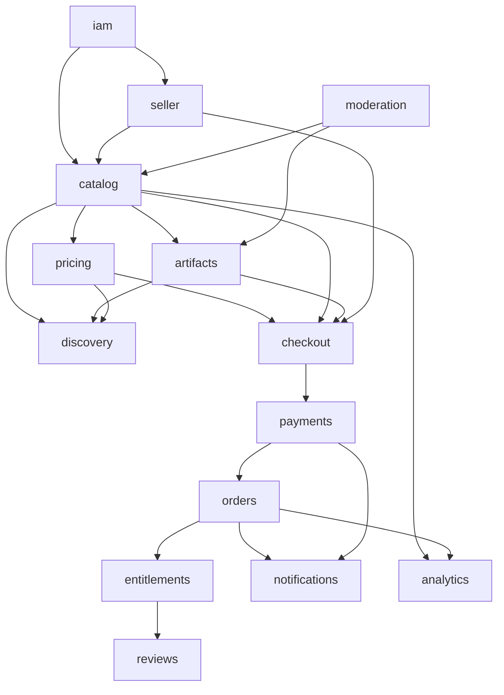

# Architecture audit

**Status:** Review of the documentation pack. **Date:** 2026-09-28. **Code:** none. **Stack:** validated as appropriate, not owner-approved.

This audit does not accept Gate A, Gate B, or Gate C. It does not choose a payment provider, a commission, or a host.

## Method

Cross-read of the brief, architecture map, modules, data ownership, state machines, sequences, API, events, payments, artifacts, security, slices, and ADRs. Contradictions were corrected in place only when one document was already the consistency anchor, or when two paths could double-apply money or access. Product choices stay OPEN.

## Verdict

The design fits a first release of one marketplace: one catalog, three lenses, a modular NestJS monolith, PostgreSQL, an internal ledger, and an isolated scanner. It does not need microservices, Kafka, Kubernetes, or a separate search cluster yet.

The pack was not safe to implement as written. The findings below are the blockers inside the documents. Commercial blockers remain in [00-ASSUMPTIONS-QUESTIONS](00-ASSUMPTIONS-QUESTIONS.md).

## Stack validation

| Choice | Verdict | Why it fits the first product |
| --- | --- | --- |
| Next.js, React, TypeScript | Appropriate | Public listing pages need server rendering for search engines. The web app is not the security boundary. |
| NestJS, REST, OpenAPI | Appropriate | One codebase can enforce module ports and guards. A second public API style (GraphQL, gRPC) adds a contract to keep in sync. |
| Modular monolith | Appropriate | Checkout and the ledger must commit together. Splitting them into services now adds partial-failure modes without a measured load problem. See [ADR 0001](ADR/0001-modular-monolith.md). |
| PostgreSQL | Appropriate | Orders, entitlements, and a double-entry ledger are relational. One database is enough for the capacity assumption in the NFR doc. |
| Prisma | Appropriate with kill criteria | Acceptable for module CRUD if ledger uniqueness lives in SQL. Slice 7 must prove that before any further payment work. Drizzle remains the fallback in [ADR 0002](ADR/0002-persistence-orm.md). |
| Redis + BullMQ | Appropriate | Scan, mail, outbox relay, and payout jobs must leave the request. Redis is not the book of record. |
| S3-compatible storage | Appropriate | Presigned upload and download keep archive bytes off the API. The vendor stays OPEN with hosting. |
| Dedicated search engine | Not now | PostgreSQL full text matches an early catalog. Revisit only if a measured search target fails ([ADR 0003](ADR/0003-search.md)). |
| Microservices, Kafka, Kubernetes | Not now | No scale or team-split evidence. ADR 0001 and ADR 0006 already reject them for MVP. |

Nothing in this table is an accepted ADR. Gate A still requires the owner.

## What already matched the business

- One product row. JS/TS and business apps are views ([BRIEF](../BRIEF.md), [ADR 0003](ADR/0003-search.md)).
- Version bytes do not change after upload. A new file is a new version.
- Money is integer minor units. The ledger is insert-only. The provider is not the book.
- Commission is configuration. The 10–20% range is illustrative.
- Paid download rechecks an entitlement. Links expire.
- Seller code is not executed on the API.
- Services, subscriptions, and team seats are out of MVP.
- Live charges and production hosting are blocked on Gates B and C.

## Module dependencies

Arrows are the allowed direction. A module may call the target’s application port (solid in the narrative) or consume its events (dashed). No repository imports.

`admin` is an entry point over moderation, payouts, and break-glass. It does not own products or ledger lines.

Capture is special: the webhook composition root calls `payments`, `orders`, and `checkout` ports in one database transaction. That is specified in [05-DATA-OWNERSHIP](05-DATA-OWNERSHIP.md). It is not a license for other cross-writes.

## Findings

| ID | Severity | Issue | What this audit did |
| --- | --- | --- | --- |
| AF-1 | High | Publish rules disagreed. The listing table allowed publish with an approved version and a non-suspended seller. A later sentence forbade publish before seller verification. | Left the choice OPEN. Documents no longer assert both. Owner decision Q20. |
| AF-2 | High | `payments.charge_captured` and the capture transaction could both create an order. Refund and dispute events could revoke or freeze an entitlement twice. | Event catalog now has one side-effect owner per outcome. |
| AF-3 | High | The seller could supply the archive checksum that the platform then trusted. | The trusted worker computes `sha256`. The client value is not the record. |
| AF-4 | High | The scan process was described both as database-free (container diagram) and as loading the artifacts service (module doc). | Scan has object-storage and queue credentials only. The worker applies the verdict. |
| AF-5 | Medium | The architecture map gave `checkout` a cart, while the domain model said a persistent cart is not an MVP entity. | Checkout owns the session. A multi-item cart is FUTURE. |
| AF-6 | Medium | The brief told admins to “request changes.” The version state machine has no such state. | Reject with a note. The seller uploads a new version. |
| AF-7 | Medium | Fifteen PostgreSQL schemas on day one fight Prisma and do not add a security boundary the import tests do not already give. | Not applied. Recommendation only. See below. |
| AF-8 | Medium | No seller appeal route, no verification submit route, no preview-image upload, no password reset, no email verification. | Routes and slice tasks added as work, not as new product policy. |
| AF-9 | Medium | `artifacts.version_withdrawn` and promotion (`private_key` set) had no events, so discovery could list a product that cannot be sold. | Events added. A version is sellable only after promotion. |
| AF-10 | Medium | Idempotency keys were described as checkout-owned, but refunds and payouts need their own keys. | Each command’s module stores its own key. |
| AF-11 | Low | Webhook text could be read as “return 200 after the inbox insert” before the journal and the order commit. | 200 means the capture transaction committed, or the event id was a duplicate. |

## Proposed improvement not applied

**AF-7. Fewer schemas, same modules.**

| Option | Advantage | Disadvantage |
| --- | --- | --- |
| Keep 15 schemas | Matches the current data-ownership doc. A future split is obvious. | Heavy Prisma multi-schema setup. Easy to get migrations wrong. Little extra safety while one DB role is used. |
| Four schemas: `identity`, `catalog`, `commerce`, `ops` (recommended) | Keeps payments/orders together and catalog/artifacts together. Fewer migration edges. Module boundaries stay in code and in the import test. | A later service split needs a schema move. |
| One schema, table prefixes | Simplest first migration. | Weaker visual ownership. Prefix discipline tends to slip. |

Recommendation: option two, if Gate A is accepted. Do not rewrite [05-DATA-OWNERSHIP](05-DATA-OWNERSHIP.md) until the owner agrees. Until then, implementers follow the current schema-per-module document.

## Security notes from this pass

- Email verification and password reset are part of slice 2 in the roadmap. A marketplace account that cannot be recovered, or a seller email that was never proven, is a fraud gap.
- Preview images need their own small public upload (image types, size cap). They must not use the quarantine presign.
- The internal BFF token is a master key if the API is reachable from the internet and `X-Session-Id` is accepted there. Deployment must keep the API private except for the webhook path. This stays a critical risk until ADR 0006 is accepted.
- MFA before a payout-account change remains PROPOSED for slice 10.
- A badge may say a scan passed or a human approved. It must not say the code is secure.

## Critical risks (unchanged by documentation)

| Risk | Why it is still open |
| --- | --- |
| No payment vendor | Countries, currencies, and merchant of record are undecided. The ledger can be built against a fake provider only. |
| Seller paid out from the wrong account model | Connect-style splits and platform cash are different journals. Posting the wrong one loses track of funds. |
| Moderation staffing unknown | The design assumes a human approves the first version. If nobody staffs the queue, nothing becomes public. |
| Single region | A regional outage is downtime. “Global” is the product aim, not the runtime. |
| Policy knobs empty | Commission, refunds, reserve days, update rights, and takedown vs existing buyers. Sandbox code must not invent them. |

## Owner decisions required

Technical Gate A, plus the commercial list in [00-ASSUMPTIONS-QUESTIONS](00-ASSUMPTIONS-QUESTIONS.md), plus:

| ID | Question | Recommended alternative | Advantage | Disadvantage |
| --- | --- | --- | --- | --- |
| Q20 / AF-1 | Must a seller be verified before a listing can be public? | Yes. Drafts are allowed earlier. Payouts also require verification. | Buyers do not pay a seller you cannot pay. | Slower first listings. |
| | Alternative: publish first, hold payouts. | Faster catalog. | You may owe refunds you cannot claw back. |
| AF-7 | How many database schemas at the start? | Four schemas, modules unchanged in code. | Less setup, same boundaries. | Differs from the current data-ownership file until you accept it. |
| Q-curation | Is the JS/TS lens every JS/TS product, or only editor picks? | Start with the stack filter. Add the editorial flag when you want a curated homepage. | One catalog either way. | The homepage is less “curated” until you use the flag. |

## Implementation

Still blocked. The execution plan is [18-ROADMAP](18-ROADMAP.md). Slice order stays in [16-MVP-SLICES](16-MVP-SLICES.md).
